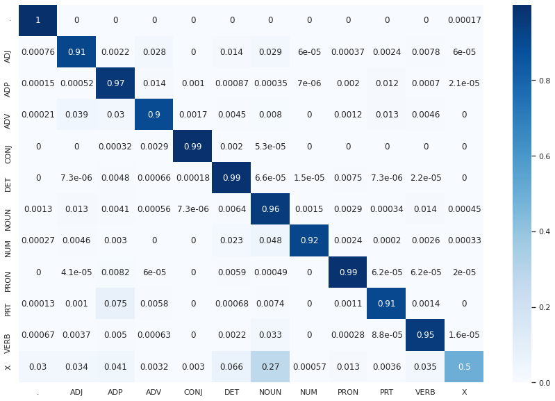

<h1 align="center">HMM POS Tagging with Viterbi Decoding</h1>

  </img>

A Hidden Markov Model (HMM) with Viterbi decoding applied on the [Brown corpus](https://www.sketchengine.eu/brown-corpus/) considering the [universal tagset](https://universaldependencies.org/u/pos/) and evaluated using 5-fold cross validation

## Usage:
See [`code/main.ipynb`](code/main.ipynb) and run it cell by cell

*(This was done as a course assignment for CS626: Speech and Natural Language Processing and the Web, Autumn 2021, IIT Bombay)*
